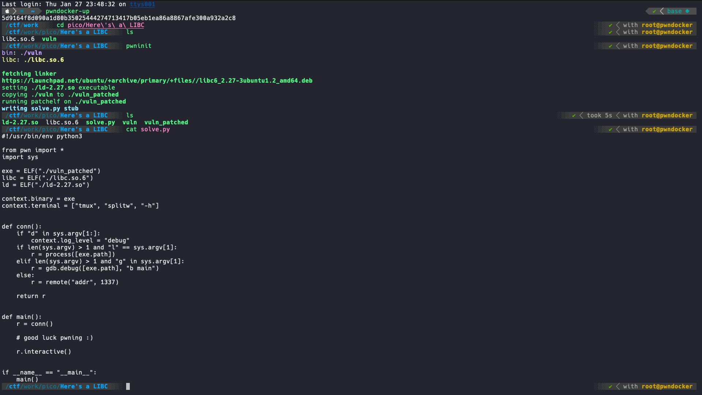
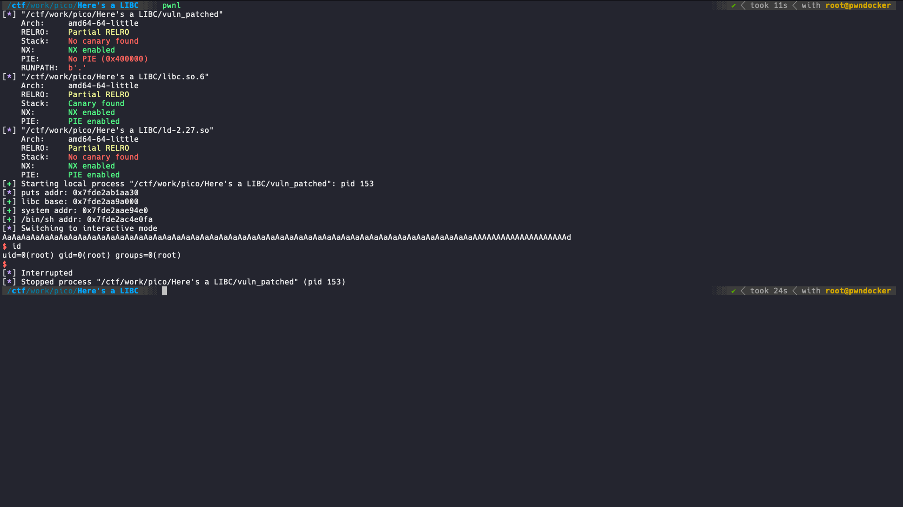
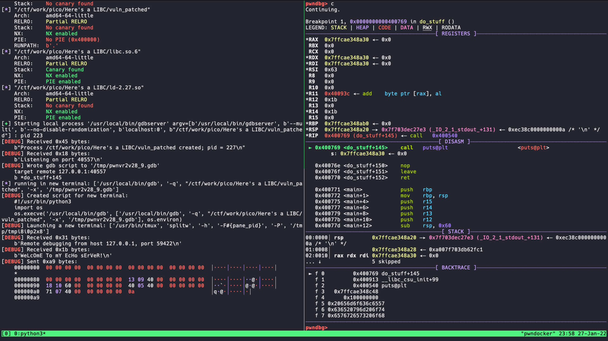
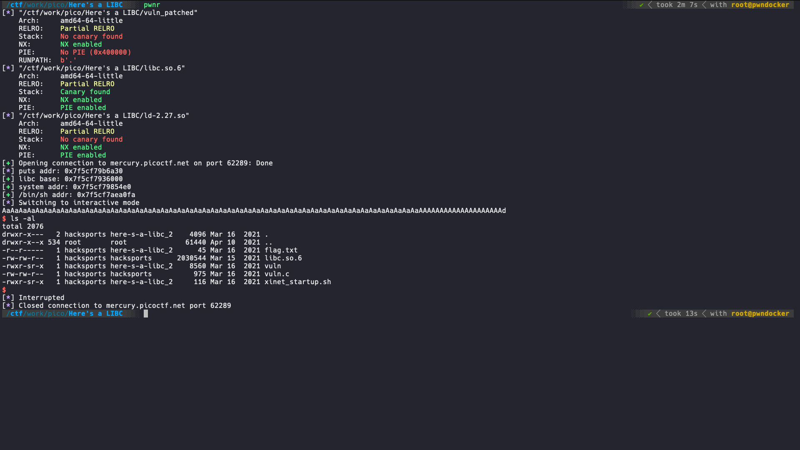
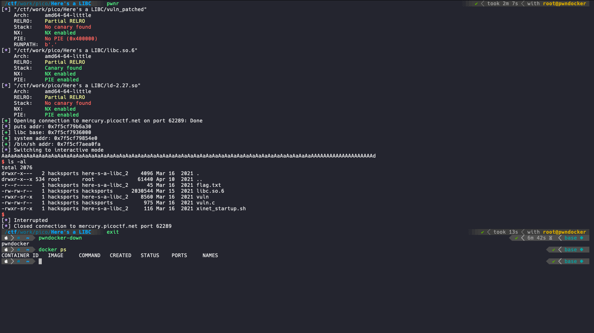

# Pwndocker

A docker environment for pwn in ctf based on **phusion/baseimage:master-amd64**, which is a modified ubuntu 20.04 baseimage for docker

Modify from [skysider/pwndocker](https://github.com/skysider/pwndocker)

## Demo

- start your pwn challenge gracefully:



- pwn the local binary (`pwnl`):



- debug with gdb and set `log_level` to `debug` (`pwng d`):



- pwn the remote binary (`pwnr`):



- exit your pwndocker gracefully:



## My enhancements

- Add support for `zsh` and use `zinit` to manage plugins

- Add customize dotfiles to the image. (`.zshrc`, `.p10k.zsh`, `.vimrc`, `.tmux.conf`)

- Add support for `pwninit` and using my customize template: `pwninit_template.py`

- Some aliases for faster pwn
  - pwninit: bind libc and create `solve.py` with my customize template
    - argv[1] == **l** : pwn local binary
    - argv[1] == **g** : pwn local binary with gdb (should be run in tmux)
    - else argv[1] : pwn remote binary
    - argv[-1] == **d** : `context.log_level='debug'`
    - pwnl: aliased to python solve.py l
    - pwng: aliased to python solve.py g
    - pwnr: aliased to python solve.py
      - If you want to pwn local binary: Run `pwnl` or `py solve.py l`
      - If you want to pwn with gdb without (debug info): Run `pwng d` or `./solve.py g`
      - If you want to pwn with gdb and debug info: Run `pwng d` or `./solve.py g d`
      - If you want to pwn the remote binary with debug info: Run `pwnr` or `./solve.py d`

- Potential bug fix:
  - `gdb.debug` can't debug 32-bit ELF with latest baseimage. (Ref: [bug](https://github.com/Gallopsled/pwntools/issues/1783))
    - Use gdb/gdbserver 11.2 to fix it
    - Please issue it if you found another solution, thanks!

Btw, I'm a noob pwner, if you have any good ideas about building a smooth pwn env for mac users, please share your ideas at issue, or u can email me! Thanks!

## Usage

```shell
# If you want to direct use all my template and dotfiles
$ docker pull lebr0nli/pwndocker

# If you want to build the image by your self
$ docker build -t pwndocker .

# replace ~/Desktop/pwndocker to the folder you want to mount
# replace container name to any name you like
$ docker run -d --rm -h pwndocker --name pwndocker -v ~/Desktop/pwndocker:/ctf/work -p 23946:23946 --cap-add=SYS_PTRACE lebr0nli/pwndocker

# pwn now!
$ docker exec -it pwndocker zsh
```

For me, I add following alias to my mac's `.zshrc`:

```shell
# pwndocker
alias pwndocker-up='docker run -d --rm -h pwndocker --name pwndocker -v ~/Desktop/pwndocker:/ctf/work -p 23946:23946 --cap-add=SYS_PTRACE lebr0nli/pwndocker && docker exec -it pwndocker zsh'
alias pwndocker-down='docker stop pwndocker'
```

## included software

- [pwntools](https://github.com/Gallopsled/pwntools)  —— CTF framework and exploit development library
- [pwninit](https://github.com/io12/pwninit)  —— automate starting binary exploit challenges
- [pwndbg](https://github.com/pwndbg/pwndbg)  —— a GDB plug-in that makes debugging with GDB suck less, with a focus on features needed by low-level software developers, hardware hackers, reverse-engineers and exploit developers
- [pwngdb](https://github.com/scwuaptx/Pwngdb) —— gdb for pwn
- [ROPgadget](https://github.com/JonathanSalwan/ROPgadget)  —— facilitate ROP exploitation tool
- [roputils](https://github.com/inaz2/roputils)    —— A Return-oriented Programming toolkit
- [one_gadget](https://github.com/david942j/one_gadget) —— A searching one-gadget of execve('/bin/sh', NULL, NULL) tool for amd64 and i386
- [angr](https://github.com/angr/angr)   ——  A platform-agnostic binary analysis framework
- [radare2](https://github.com/radare/radare2) ——  A rewrite from scratch of radare in order to provide a set of libraries and tools to work with binary files
- [seccomp-tools](https://github.com/david942j/seccomp-tools) —— Provide powerful tools for seccomp analysis
- linux_server[64]    —— IDA 7.0 debug server for linux
- [tmux](https://tmux.github.io/)    —— a terminal multiplexer
- [ltrace](https://linux.die.net/man/1/ltrace)      —— trace library function call
- [strace](https://linux.die.net/man/1/strace)     —— trace system call
- [zinit](https://github.com/zdharma-continuum/zinit)     —— Flexible and fast ZSH plugin manager

## included glibc

Default compiled glibc path is `/glibc`.

- 2.19  —— ubuntu 12.04 default libc version
- 2.23  —— ubuntu 16.04 default libc version
- 2.24  —— introduce vtable check in file struct
- 2.27  —— ubuntu 18.04 default glibc version
- 2.28~2.30  —— latest libc versions
- 2.31  —— ubuntu 20.04 default glibc version(built-in)

## Q&A

### How to run in custom libc version?

```shell
cp /glibc/2.27/64/lib/ld-2.27.so /tmp/ld-2.27.so
patchelf --set-interpreter /tmp/ld-2.27.so ./test
LD_PRELOAD=./libc.so.6 ./test
```

or

```python
from pwn import *
p = process(["/path/to/ld.so", "./test"], env={"LD_PRELOAD":"/path/to/libc.so.6"})

```

### How to run in custom libc version with other lib?

if you want to run binary with glibc version 2.28:

```shell
root@pwn:/ctf/work# ldd /bin/ls
linux-vdso.so.1 (0x00007ffe065d3000)
libselinux.so.1 => /lib/x86_64-linux-gnu/libselinux.so.1 (0x00007f004089e000)
libc.so.6 => /lib/x86_64-linux-gnu/libc.so.6 (0x00007f00406ac000)
libpcre2-8.so.0 => /lib/x86_64-linux-gnu/libpcre2-8.so.0 (0x00007f004061c000)
libdl.so.2 => /lib/x86_64-linux-gnu/libdl.so.2 (0x00007f0040616000)
/lib64/ld-linux-x86-64.so.2 (0x00007f00408f8000)

root@pwn:/ctf/work# /glibc/2.28/64/ld-2.28.so /bin/ls
/bin/ls: error while loading shared libraries: libselinux.so.1: cannot open shared object file: No such file or directory
```

You can copy /lib/x86_64-linux-gnu/libselinux.so.1 and /lib/x86_64-linux-gnu/libpcre2-8.so.0 to /glibc/2.28/64/lib/, and sometimes it fails because the built-in libselinux.so.1 requires higher version libc:

```shell
root@pwn:/ctf/work# /glibc/2.28/64/ld-2.28.so /bin/ls
/bin/ls: /glibc/2.28/64/lib/libc.so.6: version `GLIBC_2.30' not found (required by /glibc/2.28/64/lib/libselinux.so.1)
```

it can be solved by copying libselinux.so.1 from ubuntu 18.04 which glibc version is 2.27 to /glibc/2.28/64/lib:

```shell
docker run -itd --name u18 ubuntu:18.04 /bin/bash
docker cp -L u18:/lib/x86_64-linux-gnu/libselinux.so.1 .
docker cp -L u18:/lib/x86_64-linux-gnu/libpcre2-8.so.0 .
docker cp libselinux.so.1 pwn:/glibc/2.28/64/lib/
docker cp libpcre2-8.so.0 pwn:/glibc/2.28/64/lib/
```

And now it succeeds:

```shell
root@pwn:/ctf/work# /glibc/2.28/64/ld-2.28.so /bin/ls -l /
```
